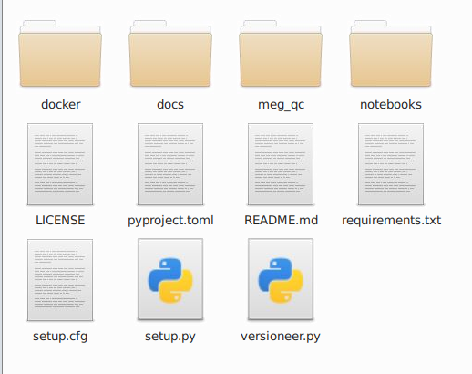

# Installation

Now we'll start with the installation process of MEG QC. Before that we want to explain you about virtual environments and containerization:
 

## Virtual environments
Virtual environments create isolated and sel-contained workspaces, allowing us to manage project-specific dependencies separated from the system-wide installation. This isollation has several benefits:
- Avoid interference among dependencies of other project-specific and system-wide dependencies avoiding common errors related to depencies, versions.
- Transparency and Open Science: Ensure that others can replicate your results or able to reproduce your analysis.

### Python Environment

MEG QC has compatiblity issues with older Python versions (prior to 3.9), therefore it's necessary to upgrade your Python version. Environments allows one to work with specific versions of Python itself without affecting other projects within the same network or the OS itself.
**[pyenv](https://github.com/pyenv/pyenv)** is a simple python version management. It let's you easily swtich between multiple versions of Python. In their github you can find the instruction to install pyenv, create your own environment with your desired Python version and activate it. 

## Install & clone the MEGqc Package
Once within your project environment or Python environment, use pip to install MEGqc core functionality by running the following command in bash:
##
        pip install --upgrade meg-qc
 

Then you will need to clone the [github repository](https://github.com/ANCPLabOldenburg/MEGqc) and unzip it. 

- The folder docker contains the starting script *run_megqc.py*.
- The folder meg_qc is a copy of the previously pip installed MEGqc package. 

## Install depencies
For MEG QC to function, you'll need to pip install the following depencies. All the hyperlinks take you to the documentation page:

- **[mne (Magnetic and Electric Neuroimaging)](https://mne.tools/stable/index.html):** "is an open-source package for exploring, visualizing and analyzing human neuropshysiological data (...). This package is also the basis for the MEGqc pipeline" (Gapontseva, 2023). It has been extensively documented and constantly updated by an active community support. 
##
        pip install --upgrade mne
 

- **[ancpbids](https://ancpbids.readthedocs.io/en/latest/userDocCombined.html):** it is a library developed in the ANCP lab and it's used to read and query BIDS datasets and also to write the derivatives back. 
##
        pip install ancpbids
 

- **[Numpy (Numerical Python)](https://numpy.org/doc/)** and **[pandas](https://pandas.pydata.org/docs/):** Both libraries are necessary for scientific computing and data manipulation in Python, such as to work with multidimensional arrays and large matrices. 
## 
        pip install numpy
##
        pip install pandas
 

- **[plotly](https://plotly.com/python-api-reference/)**: This library is used to create the interactive plots and visualizing the results. Plotly also supports exporting the figures in HTML format.
##
        pip install plotly

