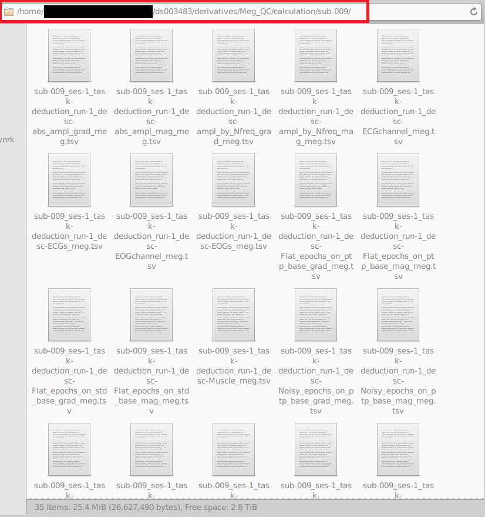

# How to make the plotting module run

Once the calculation module has completed the analysis, JSON and TSV files are generated and saved within the folder `derivatives` alongside the datasets. The `derivatives` looks something like this:

As you can see, the calculation module generates a lot of metadata files. But what if we want the data tidily ordered in a visual and interactive way? Luckily MEGqc also contains the plotting module that will produce the html reports we saw before. Let's see how can we produce them:

## Setting File Paths

First, locate the script *meg_qc_plots.py* within the `plotting`folder thin the `meg_qc` package in the `site-packages` folder of your environment. It might be in:

        /path/to/environment/lib/python3.<version>/site-packages/meg_qc/plotting/

Open the *meg_qc_plots.py* and, at the very last line where **tsvs_to_plot=** is defined, add your path to your _datasets_ (ds003483 if you are following the tutorial). The line should look similar to this:

        tsvs_to_plot = make_plots_meg_qc(ds_paths=['/path/to/dataset/'])

## Running the plotting module

Ensure that you are working from your environment and then run the script from the command line. The command might look like:

        python3 /path/to/environment/lib/python3.<version>/site-packages/meg_qc/plotting/meg_qc_plots.py

## GUI
After running the plotting command, a text-based GUI will appear in the terminal asking you several questions about specific parameters, the available options are based on the metadata MEGqc finds in your dataset.:
- Subjects: ALL or a specific one
- Sessions: ALL or a specific one
- Tasks: ALL or a specific one
- Runs: ALL or a specific one
- Metrics: ALL or a specific one
- Sensors: ALL or only magnetometers or gradiometers

## Congrats!

YOu got it! Now you have the html reports within the `derivatives` folder of the dataset. You may open them with Chrome or Firefox and check the interactive plots of the quality control analysis of your dataset!

